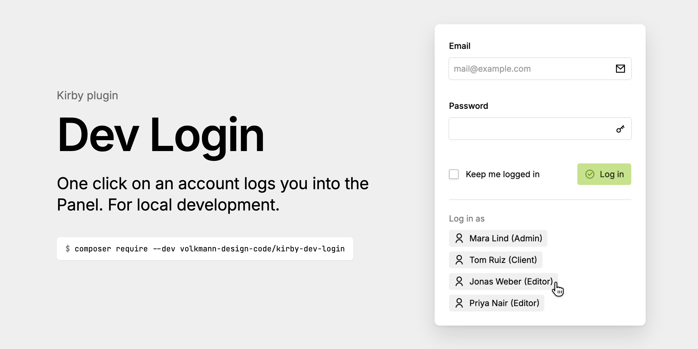

# Kirby Dev Login

**Kirby 5** · PHP 8.2–8.5 · MIT

One-click login for local development: the Panel's login form gets a
button per account, which logs that account in without a password.
Handy when you switch between roles all day.

Kirby's login form stays as it is; the buttons sit below it. The plugin
uses Kirby's own extension point for the login form
(`panel.plugin(…, { login })`), no DOM patching.



## Safe by default

The buttons, and the two API routes behind them, only exist when

- `debug` is `true`, **and**
- the site runs on a local host (Kirby's `$kirby->environment()->isLocal()`:
  `localhost`, `*.local`, `*.test`, `*.ddev.site`, or every visitor IP is
  `127.0.0.1`/`::1`).

Otherwise the routes answer 404 and the login form looks as always. Only
accounts with Panel access get a button. A login still needs the Panel's
CSRF token, like Kirby's own login route.

## Similar concepts and plugins

- [Kirby Impersonate](https://github.com/nerdcel/kirby-impersonate) by
  nerdcel: admins (or allowed roles) view the Panel as another user from
  a button on that user's profile page, also on a live site. You log in
  first, and the impersonation runs within your own session until you end
  it. It checks what a user sees; Dev Login skips the login while you
  develop. The two work side by side.
- [Kirby Autologin](https://github.com/kirby-deprecated-plugins/kirby-autologin)
  by Jens Törnell, for Kirby 2 and no longer maintained: on localhost,
  visiting `/login` or `/login/<username>` logged you into the Panel
  without a password. Dev Login brings the idea to Kirby 5, with a button
  per account instead of a URL to know.
- The Kirby team's [test environment for Kirby itself](https://github.com/getkirby/sandbox)
  (not a plugin) logs its test accounts in through a URL
  (`/env/auth/<email>`) and has a dialog in the Panel to switch to
  another account once you are logged in.

## Install

### Composer

```sh
composer require --dev volkmann-design-code/kirby-dev-login
```

As a dev dependency it stays out of deployments built with
`composer install --no-dev`.

### Git submodule

```sh
git submodule add https://github.com/volkmann-design-code/kirby-dev-login.git site/plugins/dev-login
```

### Download

Download the [latest release](https://github.com/volkmann-design-code/kirby-dev-login/releases/latest)
and unzip it into `site/plugins/dev-login`.

Without Composer, make sure the plugin doesn't reach your live site,
e.g. by leaving `site/plugins/dev-login` out of the deployment. It stays
off there anyway unless `debug` is on and the host is local.

Kirby lets one plugin replace the login form, so this plugin can't be
combined with another that does.

## Usage

Turn on `debug` in your local config and open the Panel's login page:

```php
// site/config/config.localhost.php
return ['debug' => true];
```

Below the login form, click an account to log in as it.

## Options

```php
// site/config/config.php
return [
	'volkmann-design-code.dev-login' => [
		// null (default): on with `debug` on a local host;
		// or true, false, or fn (Kirby\Cms\App $kirby): bool
		'enabled' => null,
		// null (default): every account with Panel access;
		// or fn (Kirby\Cms\App $kirby): Kirby\Cms\Users|array of emails
		'users'   => null,
	],
];
```

Buttons are sorted by role, then name; each shows the name and, in
parentheses, the role; the email on hover.

## How it works

- `GET /api/dev-login`: the accounts (`email`, `name`, `role`)
- `POST /api/dev-login` with `email`: `$user->loginPasswordless()`
- `index.js`: the login form plugin. It renders Kirby's `k-login-form`
  and the buttons below. Written with render functions, so it works
  without the Panel's template compiler (`panel.vue.compiler: false`).

## Languages

The label above the buttons comes in English and German, and falls back
to English in other Panel languages; role titles are translated by
Kirby. More languages are welcome as a pull request (`index.php`).

## Development

```sh
composer install    # Kirby into kirby/, PHPUnit
composer test
```

The cover image `.github/cover.png` is rendered from a real Panel with
made-up accounts, the same on every run (pinned Chromium and fonts):

```sh
cd .github/cover
npm ci && npx playwright install chromium
npm run cover
```

## License

MIT, see [LICENSE](LICENSE). By [volkmann design code](https://www.volkmann-design-code.de).
